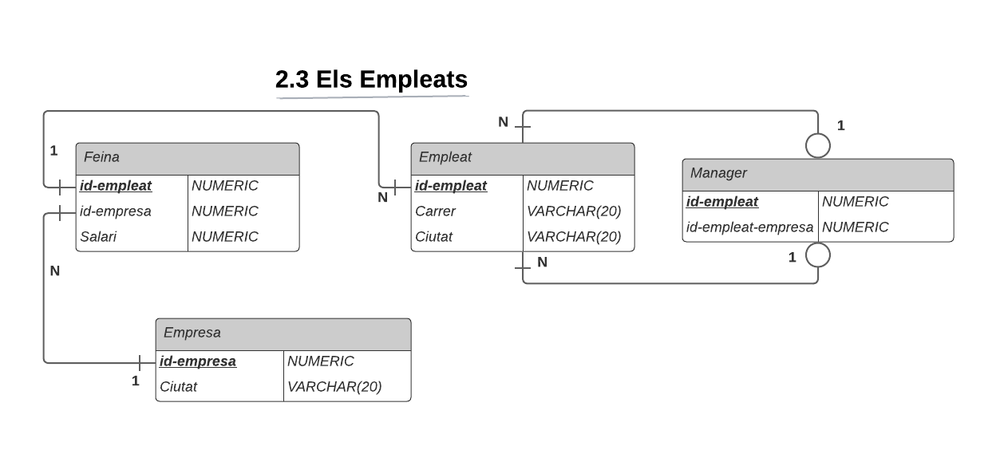

.. Els Empleats documentation master file, created by
   sphinx-quickstart on Sat Mar 18 11:34:44 2023.
   You can adapt this file completely to your liking, but it should at least
   contain the root `toctree` directive.

===============================
Documentation The Employees DB
===============================

.. image:: upc.jpg 	
   :width: 350
   :align: center

This program is a basic application to handle a database about employees.
Below there is the ER Diagram showing how the database is structured. The 
application handles the following actions:

- **Insert**: User introduces an element in a table
- **Delete**: User deletes an element from a table
- **Modify**: User modifies a specific element from a table
- **View**: User selects a table and displays its rows
- **Specific Queries**: Strongly related to the DB theme. See the main module for more information

The application is very robust and checks for all user inputs, ensuring that
the user will not insert invalid data nor attempt to perform SQL injection.

.. toctree::
   :maxdepth: 2
   :caption: Contents:

   modules/modules

Indices and tables
==================

* :ref:`genindex`
* :ref:`modindex`
* :ref:`search`